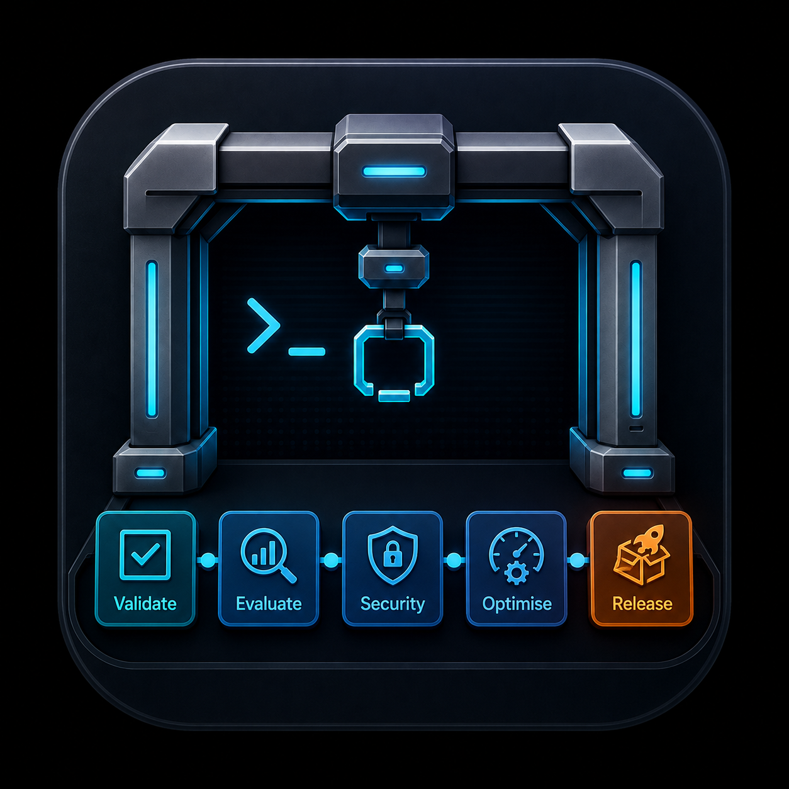
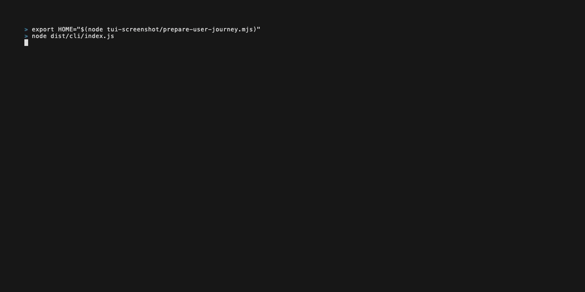
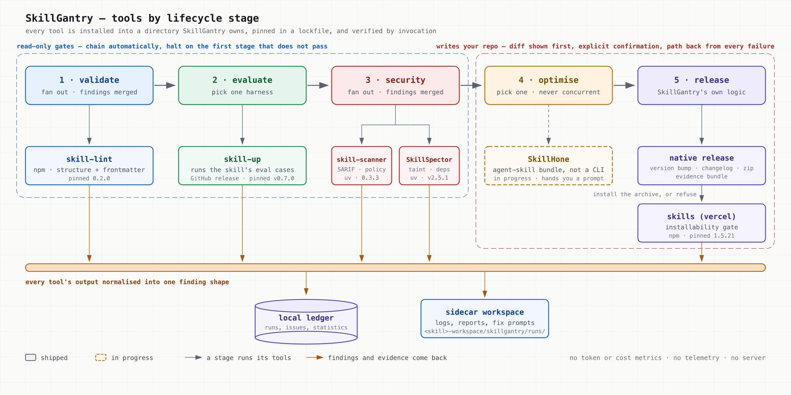

<p align="center">
  
</p>

<h1 align="center">SkillGantry</h1>

<p align="center">A terminal orchestrator for people who maintain agent skills.</p>

<p align="center">
  
</p>

---

You maintain a repo of agent skills that other people use. Before you ship a change you want to know it lints, its evals still pass, no scanner has found anything nasty, and the archive a consumer receives actually installs. Today that is five CLIs, five output formats, and a note somewhere about which ones you ran.

SkillGantry runs them for you, over one skill or twenty, and keeps the answer.

- **Installs the tools itself.** Pinned versions, into a directory it owns. Nothing lands in your global environment.
- **Runs the lifecycle as a pipeline.** `validate → evaluate → security` chain and stop at the first stage that does not pass.
- **Normalises every tool's output into one finding shape**, merges duplicates across tools, and tracks each one as an issue that closes only when every tool that saw it agrees it is gone.
- **Keeps the evidence.** Logs, reports and a fix prompt land in the skill's own sidecar workspace. Runs and issues land in a local SQLite ledger.
- **Guards the release.** Version bump, changelog, archive, then a real install of that archive to prove it resolves, before a single byte of your repo changes.

Only `release` and `retire` write to your repo, and only after showing you the diff and asking.

## Tools by stage



| Stage | Tools | Policy | What you get |
|---|---|---|---|
| 1 · validate | `skill-lint` (npm, pinned 0.2.0) | fan out, findings merged | structure and frontmatter problems |
| 2 · evaluate | `skill-up` (GitHub release, pinned v0.7.0) | pick one | the skill's own eval cases, run and scored |
| 3 · security | `skill-scanner` (uv, 0.3.3) · `SkillSpector` (uv, v2.5.1) | fan out, findings merged | SARIF and policy checks from one, taint and dependency analysis from the other |
| 4 · optimise | `SkillHone` — **being built now** | pick one, never concurrent | a coding-agent prompt built from the skill's recorded evidence. SkillGantry composes it; it never applies the result |
| 5 · release | native, gated by `skills` (vercel, pinned 1.5.21) | — | dual version bump, changelog, `<skill>_<version>.zip`, evidence bundle, and a real install of that archive |

There are no token or cost metrics anywhere, by the way. The upstream eval harness reports zero for both, and a wrong cost number is worse than none.

## The tool catalogue

Every tool SkillGantry installs, where it comes from, and how it gets there. Versions are the pins in [`src/core/tools/catalogue.ts`](src/core/tools/catalogue.ts) — that file is the authority, not this table.

| Tool | Repo | Stage | Installed by | What it does |
|---|---|---|---|---|
| skill-lint | [himself65/skill-lint](https://github.com/himself65/skill-lint) | validate | private npm prefix, `0.2.0` | Lints a skill's structure and `SKILL.md` frontmatter |
| skill-up | [alibaba/skill-up](https://github.com/alibaba/skill-up) | evaluate | GitHub release binary, `v0.7.0`, checksum-verified | Runs the eval cases a skill carries in `evals/` and scores them per assertion |
| skill-scanner | [cisco-ai-defense/skill-scanner](https://github.com/cisco-ai-defense/skill-scanner) | security | `uv tool install`, `0.3.3` | Cisco's scanner: SARIF output, policy checks, data-flow |
| SkillSpector | [NVIDIA/SkillSpector](https://github.com/NVIDIA/SkillSpector) | security | `uv tool install` from git, `v2.5.1` | NVIDIA's scanner: taint tracking, dependency checks, signatures. LLM analysis by default; `--no-llm` needs no credential. The only tool with a baseline file, so the only one `s` can suppress into |
| skills | [vercel-labs/skills](https://github.com/vercel-labs/skills) | none — release invokes it | private npm prefix, `1.5.21` | The consumer-side installer. Release extracts its own archive and installs it with this, which is what turns release into a gate |
| SkillHone | [Tencent/SkillHone](https://github.com/Tencent/SkillHone) | optimise — **in progress** | clone + per-skill symlink, deps in a managed venv | A bundle of agent skills, not a CLI. SkillGantry will install it and compose the prompt; it never runs the loop and never applies the result |

### Considered, not supported

Each of these was probed against its real index and left out on the evidence, with the probe output recorded in [`plan_m3-tools-module.md`](docs/specs/plan_m3-tools-module.md) and [`decision-log.md`](docs/specs/decision-log.md) §10. The question was only whether SkillGantry can drive it today.

| Tool | Repo | Why not |
|---|---|---|
| agentskills | [agentskills/agentskills](https://github.com/agentskills/agentskills) | Not on PyPI or npm. The repo is the specification and docs: `private: true`, no `bin`, no tags. Nothing to install |
| SkillOpt | [microsoft/SkillOpt](https://github.com/microsoft/SkillOpt) | Installs from PyPI, then fails verification. Its three entry points are argparse research scripts and none answers `--version`, so no lock entry can be written |
| promptfoo | [promptfoo/promptfoo](https://github.com/promptfoo/promptfoo) | Drives off a per-project `promptfooconfig.yaml`. It has no concept of a skill, and zero configs exist across the 74 skills in both reference repos. Writing one would be a mutation during a read-only stage |
| SkillHub | [iflytek/skillhub](https://github.com/iflytek/skillhub) | A Java server. SkillGantry ships no server component and no registry |
| Langfuse · Opik | [langfuse/langfuse](https://github.com/langfuse/langfuse) · [comet-ml/opik](https://github.com/comet-ml/opik) | Docker-compose observability platforms, for production telemetry that does not exist here. "Observe" is satisfied by statistics over runs SkillGantry itself executed |
| Backstage | [backstage/backstage](https://github.com/backstage/backstage) | A Node monorepo portal app, not a CLI a pipeline stage can spawn |

promptfoo is the reversible one: if a per-skill config convention appears, it comes back as a catalogue entry plus an adapter and nothing else moves.

## Requirements

- Node >= 24
- `npm` on PATH, for the npm-installed tools
- [`uv`](https://docs.astral.sh/uv/) on PATH, for the Python tools. Setup tells you if it is missing, and prints the official install command rather than running it for you
- A provider credential for SkillSpector's LLM analysis, if you want it. Static analysis needs none.

## Installation

Not published to npm yet. Install from a checkout:

```bash
git clone https://github.com/kevinlin/skill-gantry.git
cd skill-gantry
pnpm install
pnpm install:cli
```

That builds, packs, installs into `~/.skillgantry/versions/<version>` and links `~/.local/bin/skillgantry` onto it with one atomic rename. It then invokes the binary and refuses if it cannot answer `--version`. If `~/.local/bin` is not on your PATH, the script says so.

Each version gets its own prefix, and the two newest are kept — the previous one is what makes a rollback a relink rather than a reinstall.

Re-run `pnpm install:cli` any time to pick up a newer working tree. To remove it:

```bash
rm -f ~/.local/bin/skillgantry && rm -rf ~/.skillgantry/versions
```

## Quickstart

**1. Run setup.** Four steps: probe your runtimes, choose tools, install and verify them, then write credentials and register your first repo. Every step is re-enterable, so a failed install does not send you back to the start.

```bash
skillgantry setup
```

Pick a preset if you would rather not choose per stage:

| Preset | Tools |
|---|---|
| Minimal | skill-up, SkillSpector |
| Recommended | one per stage: skill-lint, skill-up, SkillSpector |
| Everything | the whole catalogue |

All three include vercel `skills`, because a toolchain without it cannot gate a release.

**2. Point it at a repo.** Setup asks for one. A skill is any direct child directory holding a `SKILL.md`; a repo whose own root has one is a single-skill repo. Git or not — that choice only selects how SkillGantry isolates a mutation.

**3. Open the terminal app.**

```bash
skillgantry
```

The Work screen shows your skills on the left, the five-stage rail for the selected skill top right, and a tabbed output pane below it. `Tab` cycles the three focus zones; `j`/`k` move within the focused one; `space` marks a skill or a stage; `r` runs what you marked; `x` cancels a queued or running job; `?` lists every key; `:` opens the command palette, which is also how you reach the Dashboard, Issues, Tools and Settings screens.

**4. Run the gates.** Mark a skill, mark `validate`, press `r`. The three read-only stages chain and halt on the first one that does not pass. Watch the log stream in; when it finishes, `2` opens Findings, and `y` copies a coding-agent fix prompt built from that finding's stage — the skill directory, the commit, every tool report, and each finding's rule, location and message.

Nothing is hidden from you if the terminal is the wrong place for it. The same run works headless:

```bash
skillgantry run declawed --stage validate,evaluate,security
skillgantry run declawed --stage validate,evaluate,security --json   # ndjson events
```

Exits non-zero when any stage does not pass.

**5. Release, when the gates are green.**

```bash
skillgantry release declawed --version minor --yes
```

Release refuses unless the last gate outcomes all passed *and* were recorded against exactly the bytes you are shipping. It then stages the version bump, packages the archive, extracts it, installs it, and only after all of that shows you a diff and writes. An abort leaves no archive behind and no modified file. It never commits or tags — that stays your keystroke.

## The rest of the surface

```
skillgantry                        # the terminal app
skillgantry setup                  # first-run wizard, re-runnable
skillgantry run <skill> --stage validate,evaluate,security [--json] [--yes]
skillgantry release <skill> --version <semver|major|minor|patch> [--yes] [--notes <text>]
skillgantry retire <skill> [--undo] [--superseded-by <id>]
skillgantry fix <skill> [--stage <stage>] [--run <id>]      # print a fix prompt
skillgantry suppress <skill> --tool <id> --rule <id> --path <p> --reason <text>
skillgantry doctor                 # re-verify every locked tool, report drift
skillgantry recover                # resolve a mutation interrupted by a crash
```

`skillgantry fix declawed --stage security | pbcopy` works. So does `skillgantry doctor --json` in CI.

Accepted a false positive? `s` on the Findings pane or the Issues screen writes the rule into the tool's *own* baseline file — the one the tool already reads, so CI and anyone who installs your archive see the same decision. SkillGantry keeps no suppression list of its own.

## Where things end up

```
~/.skillgantry/
  config.json          repos, tool selection, concurrency, timeouts
  .env                 credentials, mode 600, never copied into an artefact
  gantry.db            runs, issues, statistics
  tools/               managed tool installs + lock.json

<your-repo>/
  declawed/
    SKILL.md
  declawed-workspace/
    iteration-1/       whatever you ran by hand before; read-only to SkillGantry
    skillgantry/runs/2026-08-11_14-32-07/    named for when the run started
      run.json         run id, digest, git metadata, provenance, tool lock
      01-validate/     per-tool stdout, stderr, native reports, stage.json
      ...
```

Every byte of stdout and stderr SkillGantry writes passes a redaction filter first, including secrets split across chunk boundaries. Tool-written reports and snapshots are left byte-exact and flagged as unredacted, because redacting them would corrupt the output and break rollback.

## Status and docs

Milestones M1 through M8 have shipped: engine, terminal app, tool manager, four adapters, mutating stages with worktree isolation, Dashboard and Issues screens, the Work screen overhaul, and suppression.

The specifications are the contract, and the code follows them. Start at [`docs/specs/index.md`](docs/specs/index.md); it is the only catalogue. [`decision-log.md`](docs/specs/decision-log.md) records why the product is shaped this way, [`requirements.md`](docs/specs/requirements.md) numbers what it must do, and [`design.md`](docs/specs/design.md) holds every contract.

Working on it? [`CLAUDE.md`](CLAUDE.md) is the orientation for contributors and agents alike. `pnpm check` before you commit.
