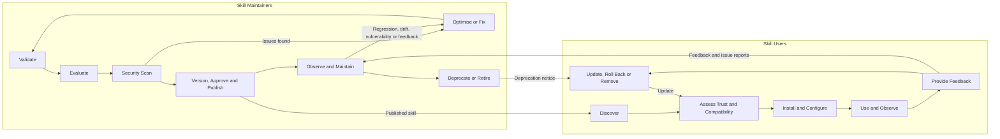

# SkillOps Lifecycles

## Overview

SkillOps can be organised into two connected lifecycles:

1. **Skill Maintainer Lifecycle**  
   Covers validation, evaluation, security, optimisation, release, monitoring, maintenance, and retirement.

2. **Skill User Lifecycle**  
   Covers discovery, trust assessment, installation, usage, feedback, updates, rollback, and removal.

The two lifecycles connect through published releases, runtime telemetry, user feedback, issue reports, and security findings.

> Authoring is intentionally excluded. The lifecycle begins when a new or modified skill enters validation.

## Lifecycle Illustration



---

# Skill Maintainer Lifecycle

## 1. Validate

Confirm that the skill follows the expected structure, metadata rules, dependency conventions, and runtime requirements.

### Recommended open-source projects

- [skill-lint](https://github.com/himself65/skill-lint)  
  A dedicated linter for Agent Skills, suitable for local checks and CI pipelines.

- [Agent Skills Reference Library](https://github.com/agentskills/agentskills/tree/main/skills-ref)  
  The reference parser and validator for the Agent Skills specification.

---

## 2. Evaluate

Measure trigger behaviour, task success, output quality, regressions, compatibility, latency, token usage, and cost.

This stage runs whenever a skill is created, modified, repaired, or optimised.

### Recommended open-source projects

- [Skill-Up](https://github.com/alibaba/skill-up)  
  A dedicated evaluation framework for agent skills, with YAML test cases, multiple agent runtimes, evaluators, and CI reports.

- [Promptfoo](https://github.com/promptfoo/promptfoo)  
  A mature framework for LLM evaluation, regression testing, model comparison, assertions, and red-team testing.

---

## 3. Security Scan

Check the skill for prompt injection, unsafe instructions, credential access, dangerous scripts, data exfiltration, vulnerable dependencies, and excessive permissions.

### Recommended open-source projects

- [Cisco AI Skill Scanner](https://github.com/cisco-ai-defense/skill-scanner)  
  A dedicated scanner for agent skills with static analysis, policy checks, data-flow analysis, SARIF output, and CI integration.

- [NVIDIA SkillSpector](https://github.com/NVIDIA/SkillSpector)  
  A skill security scanner supporting static analysis, dependency checks, taint tracking, signatures, and optional model-assisted analysis.

---

## 4. Optimise or Fix

Improve instructions, trigger descriptions, examples, scripts, references, compatibility, reliability, cost, and security.

Every change returns to validation, evaluation, and security scanning.

### Recommended open-source projects

- [Microsoft SkillOpt](https://github.com/microsoft/SkillOpt)  
  Optimises natural-language skill instructions using execution results and validation-gated iterations.

- [Tencent SkillHone](https://github.com/Tencent/SkillHone)  
  Supports iterative improvement of complete skill folders, including instructions, scripts, references, and version-controlled changes.

---

## 5. Version, Approve and Publish

Create a traceable release with version metadata, provenance, evaluation evidence, security results, approval records, and rollback support.

### Recommended open-source projects

- [SkillHub](https://github.com/iflytek/skillhub)  
  A self-hosted skill registry with semantic versions, release channels, namespaces, access control, approvals, and audit logs.

- [Vercel Skills](https://github.com/vercel-labs/skills)  
  A Git-based distribution and installation tool for reusable skills across supported agent environments.

---

## 6. Observe and Maintain

Monitor production usage, quality, errors, costs, model compatibility, skill drift, dependency health, and user feedback.

### Recommended open-source projects

- [Langfuse](https://github.com/langfuse/langfuse)  
  An open-source platform for LLM and agent traces, evaluations, datasets, feedback, metrics, and self-hosted observability.

- [Opik](https://github.com/comet-ml/opik)  
  An open-source observability and evaluation platform for multi-step agent workflows, production traces, online evaluation, and feedback.

---

## 7. Deprecate or Retire

Mark obsolete or unsafe skills as deprecated, publish replacements, communicate migration paths, block new installations, and remove retired versions.

### Recommended open-source projects

- [SkillHub](https://github.com/iflytek/skillhub)  
  Provides registry metadata, release channels, access controls, audit history, and version lifecycle management.

- [Backstage](https://github.com/backstage/backstage)  
  A general software catalogue that can track ownership, lifecycle status, deprecation, documentation, and replacement relationships.

---

# Skill User Lifecycle

## 1. Discover

Find skills by capability, owner, runtime, release status, compatibility, or organisational approval.

### Recommended open-source projects

- [SkillHub](https://github.com/iflytek/skillhub)  
  Provides a searchable, versioned, self-hosted registry for organisational skill catalogues.

- [Backstage](https://github.com/backstage/backstage)  
  Can provide an internal catalogue for approved skills, ownership, documentation, lifecycle status, and related resources.

---

## 2. Assess Trust and Compatibility

Review provenance, permissions, supported runtimes, dependencies, evaluation results, security findings, maintenance status, and deprecation state.

### Recommended open-source projects

- [Cisco AI Skill Scanner](https://github.com/cisco-ai-defense/skill-scanner)  
  Supports pre-installation security checks and policy enforcement.

- [NVIDIA SkillSpector](https://github.com/NVIDIA/SkillSpector)  
  Provides an independent security and dependency assessment before installation.

---

## 3. Install and Configure

Install an approved version, verify its source, configure dependencies and permissions, run checks, and record the installation.

### Recommended open-source projects

- [Vercel Skills](https://github.com/vercel-labs/skills)  
  Installs skills from Git repositories, directories, or archives into supported agent environments.

- [Agent Skills CLI](https://github.com/agentskills/agentskills)  
  Provides the specification and reference tooling needed to work with portable `SKILL.md`-based skill packages.

---

## 4. Use and Observe

Use the skill while monitoring invocation behaviour, output quality, tool calls, errors, latency, token consumption, and unexpected actions.

### Recommended open-source projects

- [Langfuse](https://github.com/langfuse/langfuse)  
  Captures skill and agent traces, scores, user feedback, latency, token usage, and cost.

- [Opik](https://github.com/comet-ml/opik)  
  Supports production tracing, online evaluation, dashboards, and feedback for agent workflows.

---

## 5. Provide Feedback

Report incorrect triggering, poor output, runtime problems, security concerns, missing use cases, performance issues, and improvement suggestions.

### Recommended open-source projects

- [Langfuse](https://github.com/langfuse/langfuse)  
  Supports user feedback, trace annotations, evaluation datasets, and failure analysis.

- [Opik](https://github.com/comet-ml/opik)  
  Supports feedback collection, trace review, evaluation datasets, and issue investigation.

---

## 6. Update, Roll Back or Remove

Review release changes, update to an approved version, roll back regressions, or remove deprecated, unsafe, conflicting, or unused skills.

### Recommended open-source projects

- [Vercel Skills](https://github.com/vercel-labs/skills)  
  Provides a consistent way to install and refresh skills from version-controlled sources.

- [SkillHub](https://github.com/iflytek/skillhub)  
  Provides approved versions, release channels, lifecycle status, and registry-based version selection.

---

# Combined Control Loop

```text
Maintainer change
    → Validate
    → Evaluate
    → Security scan
    → Optimise or fix
    → Repeat until qualified
    → Version, approve and publish
    → User discovers and assesses
    → Install and use
    → Observe and provide feedback
    → Maintain, update, deprecate or retire
```

## Recommended Default Stack

| Capability | Recommended project |
|---|---|
| Validation | skill-lint |
| Evaluation | Skill-Up |
| Security scanning | Cisco AI Skill Scanner |
| Optimisation | Microsoft SkillOpt |
| Skill evolution and repair | Tencent SkillHone |
| Registry and publishing | SkillHub |
| Distribution and installation | Vercel Skills |
| Observability and feedback | Langfuse |
| Catalogue and lifecycle metadata | Backstage |
